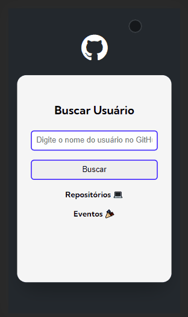

# Projeto Fetch GitHub API
Projeto feito a partir do curso de programação DevQuest💻

## Desktop do Projeto:
[]

## Versão mobile 📱
[]

## Tecnologias utilizadas 🛠
- HTML
- CSS
- JavaScript

### Sobre o Projeto 💡📌

Projeto com base em HTML, CSS E JavaScript onde o usuário pode pesquisar e encontrar outros usuário do GitHub a partir do seu nick, visualizando seu avatar, bio, repositórios e eventos recentes do seu perfil no GitHub.
Planejo ir adicionando mais elementos e funcionalidades ao projeto ao longo do meu aprendizado.
